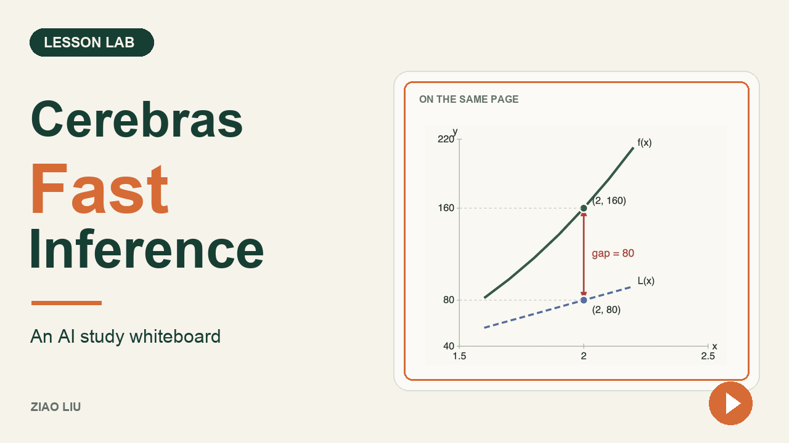

# Lesson Lab

[](https://youtu.be/5w6XOYipABk)

**[Watch the 3:55 showcase on YouTube](https://youtu.be/5w6XOYipABk)** — my study workflow, live page edits, and the recorded API comparison.

**Ask a question. Change the page you're studying.**

I'm Ziao Liu. I usually turn my course materials into HTML study guides and talk through them with ChatGPT Voice Chat. Lesson Lab is my experiment with a more responsive shared whiteboard: Cerebras generates an updated page when I need a different example, diagram, or explanation.

This repository contains the local feature demo and a separate, inspectable API comparison. It is a prototype, and the demo is **not connected to ChatGPT Voice Chat**.

| Try | What happens |
| --- | --- |
| “Change the coefficient to 15.” | Canvas sends the complete page source to Cerebras and requests updated equations, text, and SVG. |
| “Use a midnight blue theme.” | The model rewrites the page's HTML and CSS. |
| “Add a diagram explaining the gap.” | A new section appears in the same preview. |
| Inspect, undo, or save | Read the returned source, restore an earlier version, or download the current HTML. |

## Run locally

Use **Node.js 24 or newer** and a modern desktop browser. The text application has no npm dependencies and needs no build step.

```sh
git clone https://github.com/ZiaoLiu-1/lesson-lab.git
cd lesson-lab
cp .env.example .env
```

Add your own `CEREBRAS_API_KEY` to `.env`, then:

```sh
npm start
```

Open **http://127.0.0.1:4320/**. Choose **Edit this page**, open **Text & tools**, enter a prompt, and press **Ask**. Follow the [five-minute demo](docs/DEMO.md).

You can browse the prepared three-page lesson without a key. Live questions and edits use your provider account and may incur charges. Starting the app does not send an inference request. Keep keys in the local server environment; never enter them into the webpage.

## What the model changes

```text
Question + selected section + complete current HTML
                         ↓
                 Cerebras model
                         ↓
          Updated HTML / CSS / SVG + narration
                         ↓
           Source checks → sandboxed preview
```

Canvas edits a complete static document. It does not edit the application files or execute generated JavaScript. A separate prepared lesson uses trusted graph calculations and fixed teaching steps.

**Accepted source is not proof of correct teaching.** In the filmed example, both initial diagrams were right, but their explanations needed explicit correction. Review generated equations, diagrams, and prose before relying on them.

## Compare the request paths

With your own `OPENAI_API_KEY` and `CEREBRAS_API_KEY` configured:

```sh
npm run benchmark:api
```

Open **http://127.0.0.1:4337/**. Both lanes use the same HTTP function and matching request bodies, except for the model. Chrome's Network panel can inspect the local request and response. The default cohort allows four calls; it does not automatically retry.

Read [the timing method and controls](docs/BENCHMARK.md) before interpreting results. [Recorded comparisons](docs/results.html) keep the historical Codex CLI tests separate from the direct API tests. These compare different models and providers, not hardware alone.

## Voice, checks, and troubleshooting

Typing is the simplest way to try the demo. [Optional local voice](docs/VOICE.md) remains experimental; the bundled installer targets Apple Silicon macOS. It requires separate downloads. Real microphone accuracy and reliable interruption are not established by the automated tests.

```sh
npm test
npm run voice:check
```

| Issue | Next step |
| --- | --- |
| No live answer | Check the key in `.env`, model access, and provider balance; restart the server. |
| Model unavailable | The configured IDs depend on your account and provider availability. See [configuration](docs/DEMO.md#configuration). |
| Port in use | Set `STUDIO_PORT=4350` in `.env`; open the printed address. |
| Connection replaced | Use one active lesson tab, then choose Reconnect. |
| Edit rejected or voice unavailable | Keep the previous page, inspect the error, and use typing. See [demo limits](docs/DEMO.md#limits). |

Questions and page source leave your computer when you request an edit. Local state and keys are excluded from this repository. Read [privacy and local storage](docs/PRIVACY.md).

## Showcase resources

- [English voiceover draft](docs/VOICEOVER_EN.txt)
- [Full comparison viewer](docs/results.html), [data](docs/results.json), and [source records / verification](docs/results/README.md)
- [Prompts and demo walkthrough](docs/DEMO.md)

Built by Ziao Liu with AI assistance. Released under the [MIT License](LICENSE). See [third-party notices](THIRD_PARTY.md).
